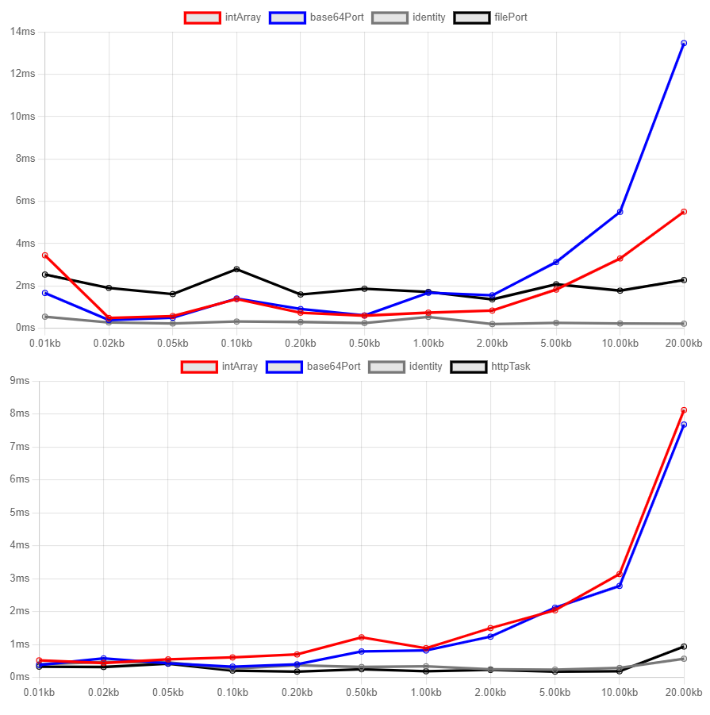

# Elm <-> JS Bytes Interop Benchmark

There are various usecases in which we want to pass Bytes directly from Javascript
to the Elm application and vice versa. A concrete usecase I struggle with is Websockets with binary data (protobuf encoding).
Unfortunately, Elm's primary interop mechanism, Ports, is based on JSON encoding and as such unable
to transfer Bytes (in the concrete form of Uint8Array, DataView or ArrayBuffer).

The goal of this benchmark is to compare the different available workarounds.

## Result

TL;DR: For transferring small amounts (< 5kb) of data at a time, use a JSON compatible encoding
such as Array (of numbers) or Base64. The difference between the two is negligible.
For big amounts of data, use the Elm File API for JS -> Elm and a HTTP prototype hack for Elm -> JS.

The first graph is JS -> Elm, the second Elm -> JS.
"identity" measures overhead due to the method used for benchmarking by just passing the Bytes back and forth as Json.Encode.Value.

## The contestants

### Int Array

While Bytes cannot be directly represented in JSON,
an array of numbers can. Thus we can copy each element of the `Uint8Array` to a standard JS array and revert the process on the Elm side via the `Bytes.Encode`/`Bytes.Decode` API.

This seems to perform reasonable well for small workloads but causes slowdown for large Arrays due to the O(n) copying.

### Base64

Similar approach but more traditional in a sense, since bytes are often encoded as Base64 in the browser, for example in URLs. Seems to be very similar to the Int Array approach in speed. I would be interested to compare the memory usages between the two, but I was not sure how to best accomplish that. Suggestions/PRs welcome!

### File API

**Warning**: Calling `File.toBytes` apparently causes memory to be leaked: https://github.com/elm/file/issues/31

The package `elm/file` includes a `File.decoder` as well as a `File.toBytes` function. 

Therefore we can call `new File(bytes, '')` on the JS side and pass that into Elm over a port without any trouble. The benchmark shows the overhead is constant/independent of the bytes size.

To my knowledge, this is the best method for large binary payloads if you have to go over a port (in many cases you get the data from a server directly, which enables you to just use the Elm Http API).

### Http "Taskport"

I call this one Taskport, since the idea is based on the 
[elm-taskport](https://package.elm-lang.org/packages/lobanov/elm-taskport/2.0.1/) library.

Essentially, we send a HTTP POST request from Elm with a nonsense URL like `elm://`.
On the JS side, we monkeypatch the XHRHttpRequest prototype by intercepting the `open` and `send` methods. We check for the nonsense URL or prefix and send the bytes from JS directly instead of sending a request.

This, for some reason, has remarkably low overhead according to the benchmark and is thus the best solution from Elm to JS for large bytes size.

